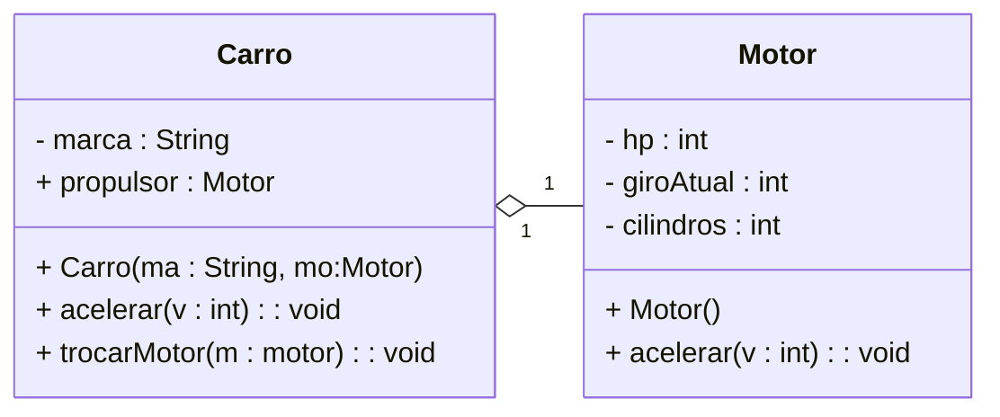

# UML 

```mermaid
classDiagram
direction LR

class Carro{
   - marca : String     
   + propulsor : Motor 
   + Carro(ma : String, mo:Motor)
   + acelerar(v : int) : void
   + trocarMotor(m : motor) : void
}

class Motor{
    - hp : int
    - giroAtual : int
    - cilindros : int
    + Motor()
    + acelerar(v : int): void
}

Carro "1" o-- "1" Motor

```