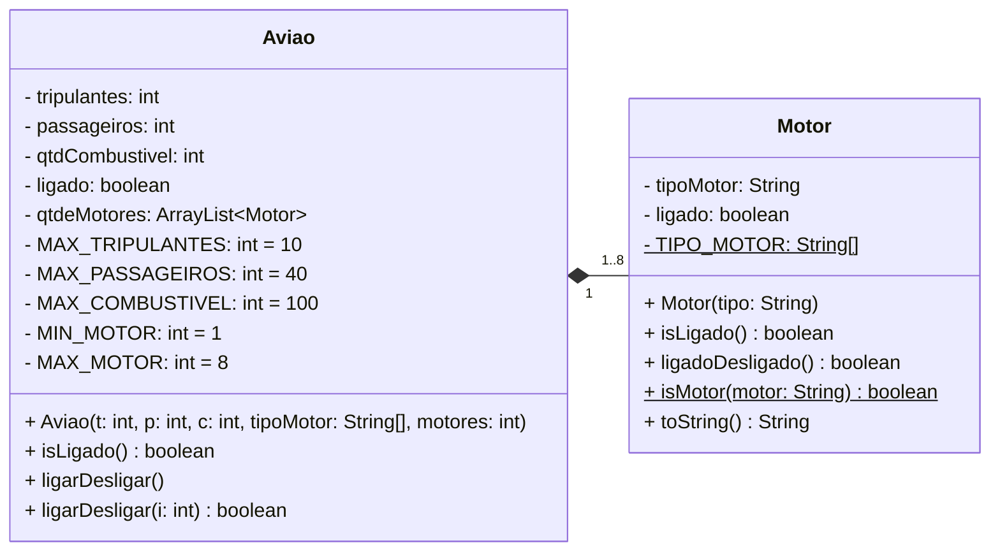

```mermaid
   classDiagram
    direction LR

    class Aviao {
        - tripulantes: int
        - passageiros: int
        - qtdCombustivel: int
        - ligado: boolean
        - qtdeMotores: ArrayList~Motor~
        - MAX_TRIPULANTES: int = 10
        - MAX_PASSAGEIROS: int = 40
        - MAX_COMBUSTIVEL: int = 100
        - MIN_MOTOR: int = 1
        - MAX_MOTOR: int = 8
        + Aviao(t: int, p: int, c: int, tipoMotor: String[], motores: int)
        + isLigado() boolean
        + ligarDesligar()
        + ligarDesligar(i: int) boolean
    }

    class Motor {
        - tipoMotor: String
        - ligado: boolean
        - TIPO_MOTOR: String[]$
        + Motor(tipo: String)
        + isLigado() boolean
        + ligadoDesligado() boolean
        + isMotor(motor: String)$ boolean
        + toString() String
    }

    Aviao "1" *-- "1..8" Motor
```

