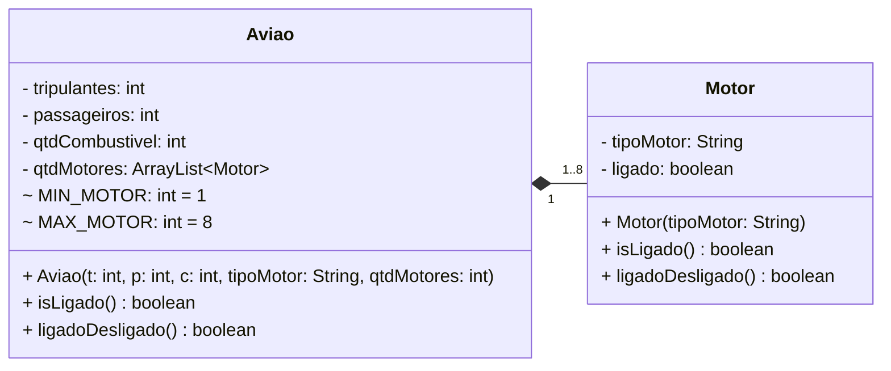

```mermaid
    classDiagram
    direction LR
    class Aviao {
        - tripulantes: int
        - passageiros: int
        - qtdCombustivel: int
        - qtdMotores: ArrayList~Motor~
        ~ MIN_MOTOR: int = 1
        ~ MAX_MOTOR: int = 8
        + Aviao(t: int, p: int, c: int, tipoMotor: String, qtdMotores: int)
        + isLigado() boolean
        + ligadoDesligado() boolean
    }
    
    class Motor{
        - tipoMotor: String
        - ligado: boolean
        + Motor(tipoMotor: String)
        + isLigado() boolean
        + ligadoDesligado() boolean
    }
    Aviao "1" *-- "1..8" Motor
```

