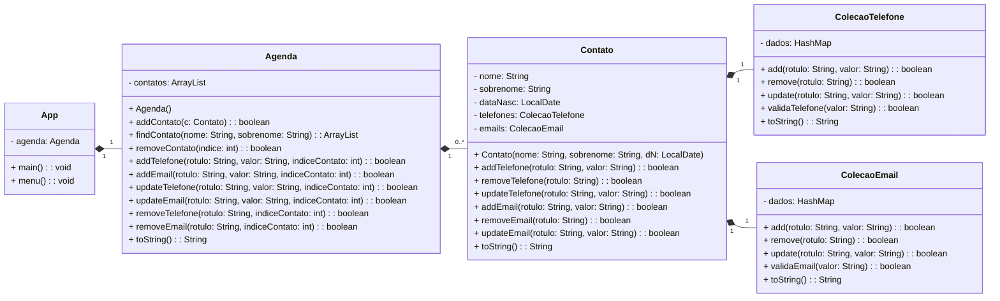

```mermaid

classDiagram
    direction LR

    class App{
        - agenda: Agenda
        + main(): void
        + menu(): void
    }

    class Agenda{
        - contatos: ArrayList<Contato>

        + Agenda()
        + addContato(c: Contato): boolean
        + findContato(nome: String, sobrenome: String): ArrayList<Contato>
        + removeContato(indice: int): boolean

        + addTelefone(rotulo: String, valor: String, indiceContato: int): boolean
        + addEmail(rotulo: String, valor: String, indiceContato: int): boolean

        + updateTelefone(rotulo: String, valor: String, indiceContato: int): boolean
        + updateEmail(rotulo: String, valor: String, indiceContato: int): boolean

        + removeTelefone(rotulo: String, indiceContato: int): boolean
        + removeEmail(rotulo: String, indiceContato: int): boolean

        + toString(): String
    }

    class Contato{
        - nome: String
        - sobrenome: String
        - dataNasc: LocalDate
        - telefones: ColecaoTelefone
        - emails: ColecaoEmail

        + Contato(nome: String, sobrenome: String, dN: LocalDate)

        + addTelefone(rotulo: String, valor: String): boolean
        + removeTelefone(rotulo: String): boolean
        + updateTelefone(rotulo: String, valor: String): boolean

        + addEmail(rotulo: String, valor: String): boolean
        + removeEmail(rotulo: String): boolean
        + updateEmail(rotulo: String, valor: String): boolean

        + toString(): String
    }

    class ColecaoTelefone{
        - dados: HashMap<String, String>

        + add(rotulo: String, valor: String): boolean
        + remove(rotulo: String): boolean
        + update(rotulo: String, valor: String): boolean
        + validaTelefone(valor: String): boolean
        + toString(): String
    }

    class ColecaoEmail{
        - dados: HashMap<String, String>

        + add(rotulo: String, valor: String): boolean
        + remove(rotulo: String): boolean
        + update(rotulo: String, valor: String): boolean
        + validaEmail(valor: String): boolean
        + toString(): String
    }
    App "1" *-- "1" Agenda
    Agenda "1" *-- "0..*" Contato
    Contato "1" *-- "1" ColecaoTelefone
    Contato "1" *-- "1" ColecaoEmail
    
```