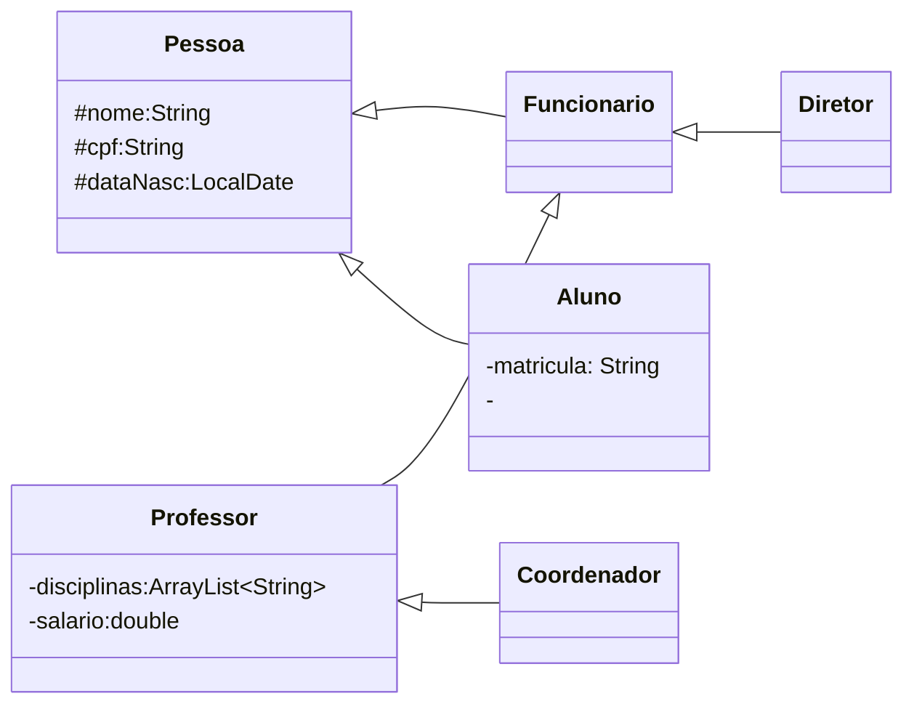
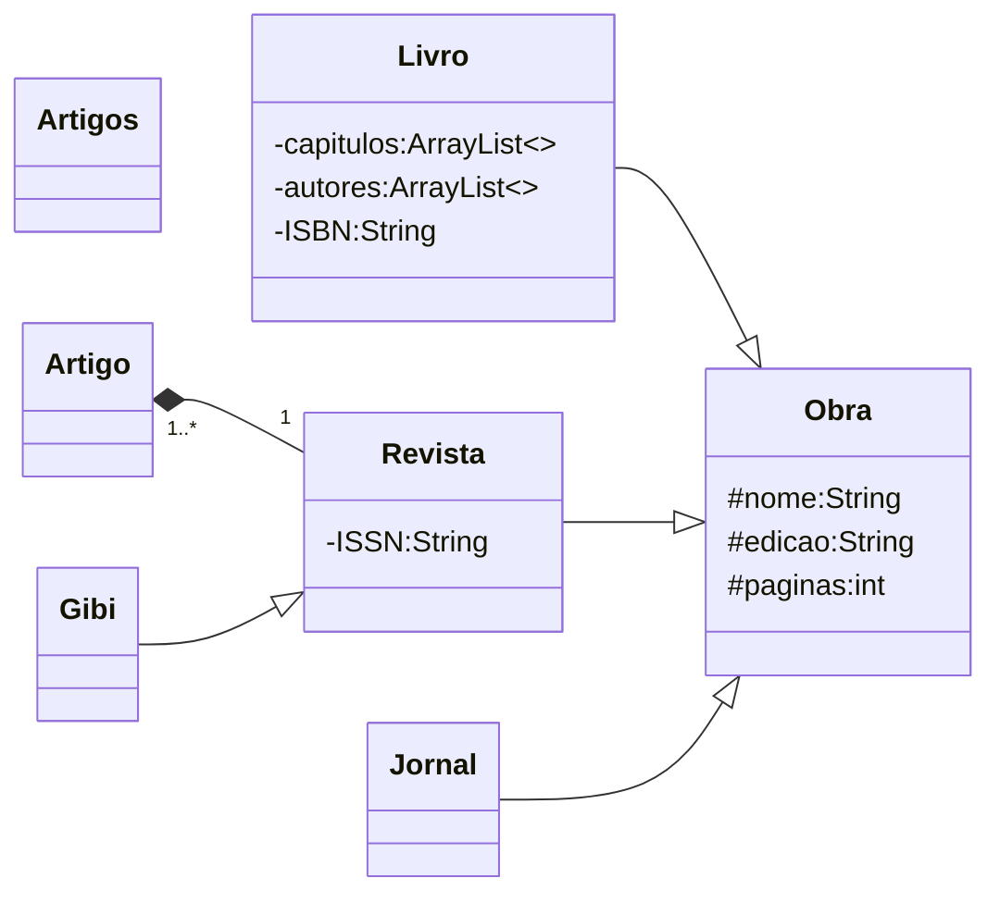

```mermaid
    classDiagram
    direction RL
    
    class Funcionario{
        
    }
    
    class Pessoa{
    #nome:String
    #cpf:String
    #dataNasc:LocalDate
    }
    
    class Aluno{
        -matricula: String
        -    
    }
    
    class Professor{
        -disciplinas:ArrayList~String~
        -salario:double
    }
    
    class Coordenador{
        
    }
    
    class Diretor{
         
    }
    
    Funcionario --|>Pessoa
    Funcionario <|-- Professor
    Diretor --|> Funcionario
    Aluno --|> Pessoa
    Coordenador --|> Professor
```

```mermaid  
    classDiagram
        direction LR
        
        class Obra{
            #nome:String
            #edicao:String
            #paginas:int
        }
        
        class Livro{
            -capitulos:ArrayList~~
            -autores:ArrayList~~
            -ISBN:String
        }
        
        class Artigos{
            
        }
        
        class Revista{
            -ISSN:String
        }
        
        class Jornal{
            
        }
        
        class Gibi{
            
        }
        Artigo "1..*" *-- "1" Revista
        Livro --|> Obra
        Revista --|> Obra
        Gibi --|> Revista
        Jornal --|>Obra
```