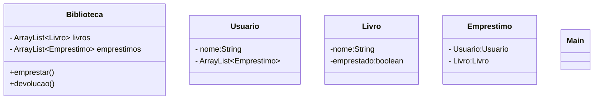

```mermaid
    classDiagram
        direction TB
        
        class Biblioteca{
           - ArrayList~Livro~ livros
           - ArrayList~Emprestimo~ emprestimos 
            +emprestar()
            +devolucao()
        }

        class Usuario{
            - nome:String
            - ArrayList~Emprestimo~
        }
        
        class Livro{
            -nome:String
            -emprestado:boolean
        }

        class Emprestimo{
            - Usuario:Usuario
            - Livro:Livro
        }

        class Main{
            
        }

```

```
```

Usuario --------- Livro
            |
            |
            |
        Emprestimo