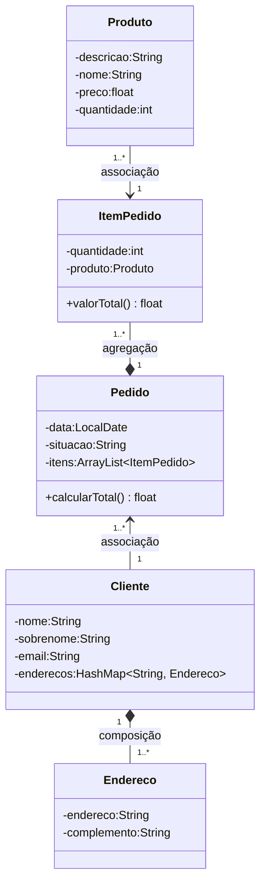

```mermaid
classDiagram
    direction TB
    
    class Produto{
        -descricao:String
        -nome:String
        -preco:float
        -quantidade:int
    }
    
    class Cliente{
        -nome:String
        -sobrenome:String
        -email:String
        -enderecos:HashMap~String, Endereco~
    }
    
    class Endereco{
        -endereco:String
        -complemento:String
    }
    
    class ItemPedido{
        -quantidade:int
        -produto:Produto
        +valorTotal()float
    }
    
    class Pedido{
        -data:LocalDate
        -situacao:String
        -itens:ArrayList~ItemPedido~
        +calcularTotal()float
    }
    
    Pedido "1..*" <-- "1" Cliente:associação
    Produto "1..*" --> "1" ItemPedido:associação
    ItemPedido "1..*" --* "1" Pedido:agregação
    Cliente "1" *-- "1..*" Endereco:composição
```