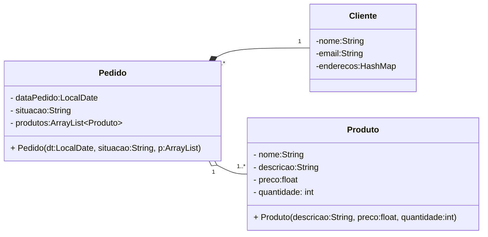

# Modelo UML da questão 1


#### placeholder class app (pode ou não ser adicionada depois)
``` 
class App{
- produtos:HashMap<String, Produto>    
+ addProduto(p:Produto, nome:String)
+ rmProduto(chave:String)
+ addEstoque(qtde:int, chave:String)
+ rmEstoque(qtde:int, chave:String)
}
```    