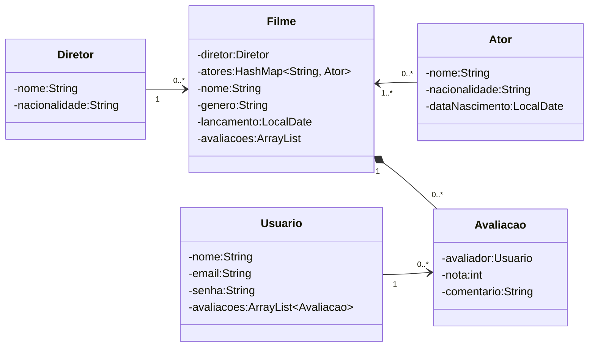

```mermaid
    classDiagram
    direction LR 
    
    class Diretor{
    -nome:String
    -nacionalidade:String
    }
    
    class Filme {
        -diretor:Diretor
        -atores:HashMap~String, Ator~
        -nome:String
        -genero:String
        -lancamento:LocalDate
        -avaliacoes:ArrayList<Avaliacao>
    }
    
    class Ator{
     -nome:String
     -nacionalidade:String
     -dataNascimento:LocalDate
    }
    
    class Avaliacao{
        -avaliador:Usuario
        -nota:int
        -comentario:String
    }
    
    class Usuario{
    -nome:String
    -email:String
    -senha:String
    -avaliacoes:ArrayList~Avaliacao~
    }
    
    Diretor "1" --> "0..*" Filme
    Filme "1..*" <-- "0..*" Ator
    Filme "1" *-- "0..*" Avaliacao
    Usuario "1" --> "0..*" Avaliacao
```