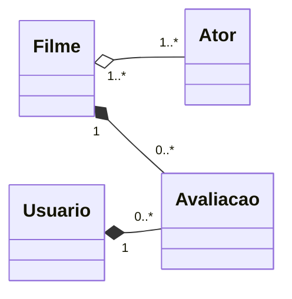

um filme pode ter um ou mais atores, mas um filme não necessariamente precisa de atores pra existir. o contrário também é verdade.
um filme pode ter 0 ou mais avaliações, e uma avaliação só pode estar associada a um filme.
um usuário pode ter 0 ou mais avaliações, e uma avaliação pertence a um usuário somente