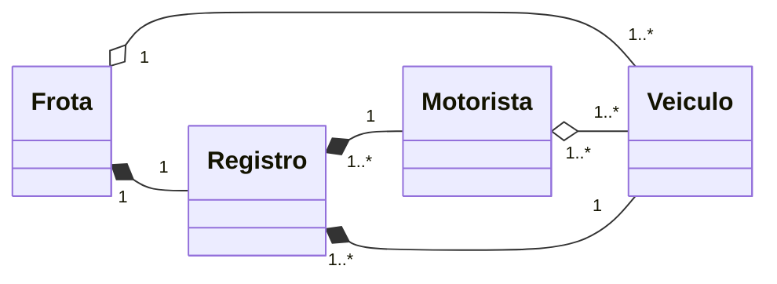

```mermaid
    classDiagram
        direction LR
        
        class Frota{
            
        }
        
        class Veiculo{
            
        }
        
        class Motorista{
            
        }
        
        class Registro{
            
        }
        
        Frota "1" o-- "1..*" Veiculo
        Motorista "1..*" o-- "1..*" Veiculo
        Registro "1..*" *-- "1" Veiculo
        Registro "1..*" *-- "1" Motorista
        Frota "1" *-- "1" Registro
```