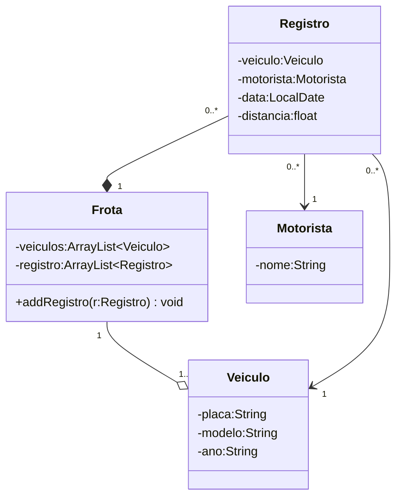

```mermaid
    classDiagram
        direction TB
        
        class Frota{
            -veiculos:ArrayList~Veiculo~
            -registro:ArrayList~Registro~
            +addRegistro(r:Registro)void
        }
        
        class Veiculo{
            -placa:String
            -modelo:String
            -ano:String
        }
        
        class Motorista{
            -nome:String
        }
        
        class Registro{
            -veiculo:Veiculo
            -motorista:Motorista
            -data:LocalDate
            -distancia:float
        }
        
       Frota "1" --o "1..*" Veiculo
       Registro "0..*" --* "1" Frota
       Registro "0..*" --> "1" Motorista
       Registro "0..*" --> "1" Veiculo
       
```