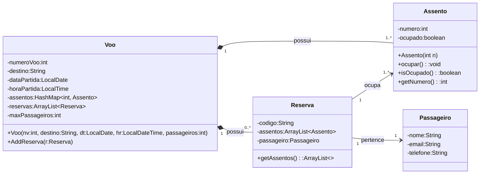

```mermaid
classDiagram
direction LR

    class Voo{
        -numeroVoo:int
        -destino:String
        -dataPartida:LocalDate
        -horaPartida:LocalTime
        -assentos:HashMap~int, Assento~
        -reservas:ArrayList~Reserva~
        -maxPassageiros:int
        +Voo(nv:int, destino:String, dt:LocalDate, hr:LocalDateTime, passageiros:int)
        +AddReserva(r:Reserva)
    }
    
    class Passageiro{
       -nome:String
       -email:String
       -telefone:String
    }
    
    class Reserva{
        -codigo:String
        -assentos:ArrayList~Assento~
        -passageiro:Passageiro
        +getAssentos():ArrayList~~
    }
    
    class Assento{ 
        -numero:int
        -ocupado:boolean
        +Assento(int n)
        +ocupar():void
        +isOcupado():boolean
        +getNumero():int
    }
    
    %% Relações
    
    Voo "1" *-- "1..*" Assento : possui
    
    Voo "1" *-- "0..*" Reserva : possui
    
    Reserva "1" --> "1" Passageiro : pertence
    
    Reserva "1" --> "1..*" Assento : ocupa
```