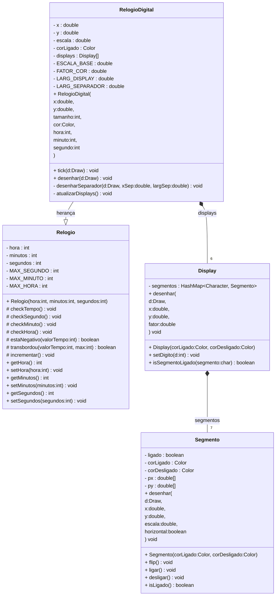

```mermaid
    classDiagram
    direction TB

class Relogio {
- hora : int
- minutos : int
- segundos : int
- MAX_SEGUNDO : int
- MAX_MINUTO : int
- MAX_HORA : int

+ Relogio(hora:int, minutos:int, segundos:int)

# checkTempo() void
# checkSegundo() void
# checkMinuto() void
# checkHora() void
# estaNegativo(valorTempo:int) boolean
# transbordou(valorTempo:int, max:int) boolean
# incrementar() void

+ getHora() int
+ setHora(hora:int) void
+ getMinutos() int
+ setMinutos(minutos:int) void
+ getSegundos() int
+ setSegundos(segundos:int) void
}

class RelogioDigital {
- x : double
- y : double
- escala : double
- corLigado : Color
- displays : Display[]

- ESCALA_BASE : double
- FATOR_COR : double
- LARG_DISPLAY : double
- LARG_SEPARADOR : double

+ RelogioDigital(
x:double,
y:double,
tamanho:int,
cor:Color,
hora:int,
minuto:int,
segundo:int
)

+ tick(d:Draw) void
+ desenhar(d:Draw) void
- desenharSeparador(d:Draw, xSep:double, largSep:double) void
- atualizarDisplays() void
}

class Display {
- segmentos : HashMap~Character, Segmento~

+ Display(corLigado:Color, corDesligado:Color)
+ setDigito(d:int) void
+ isSegmentoLigado(segmento:char) boolean
+ desenhar(
d:Draw,
x:double,
y:double,
fator:double
) void
}

class Segmento {
- ligado : boolean
- corLigado : Color
- corDesligado : Color
- px : double[]
- py : double[]

+ Segmento(corLigado:Color, corDesligado:Color)

+ flip() void
+ ligar() void
+ desligar() void
+ isLigado() boolean

+ desenhar(
d:Draw,
x:double,
y:double,
escala:double,
horizontal:boolean
) void
}

RelogioDigital --|> Relogio : herança

RelogioDigital *-- "6" Display : displays
Display *-- "7" Segmento : segmentos
        
```