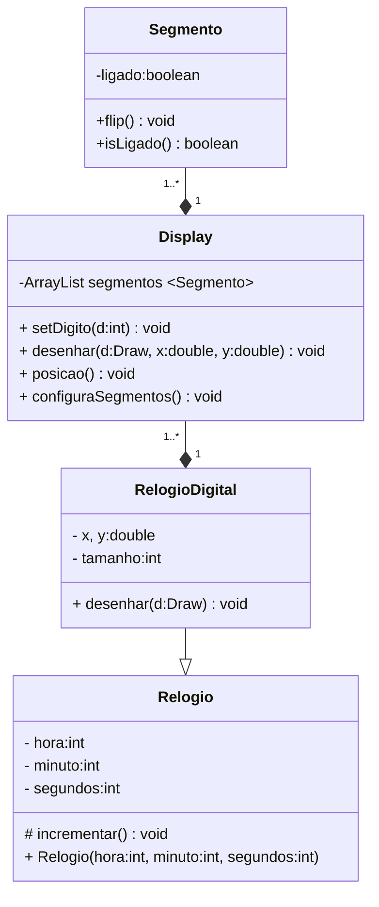

```mermaid
    classDiagram
        direction TB
        
        class Relogio{
            - hora:int
            - minuto:int
            - segundos:int
            
            # incrementar()void
            
            + Relogio(hora:int, minuto:int, segundos:int)
        }
        
        class RelogioDigital{
            - x, y:double
            - tamanho:int
            + desenhar(d:Draw)void
        }
        
        class Display{
            -ArrayList segmentos ~Segmento~
            + setDigito(d:int)void
            + desenhar(d:Draw, x:double, y:double)void
            + posicao()void
            + configuraSegmentos()void
        }  
        
        class Segmento{
            -ligado:boolean
            
            +flip()void
            +isLigado()boolean
        }
        
        Segmento "1..*" --* "1" Display
        Display "1..*" --* "1" RelogioDigital
        RelogioDigital --|> Relogio
        
```