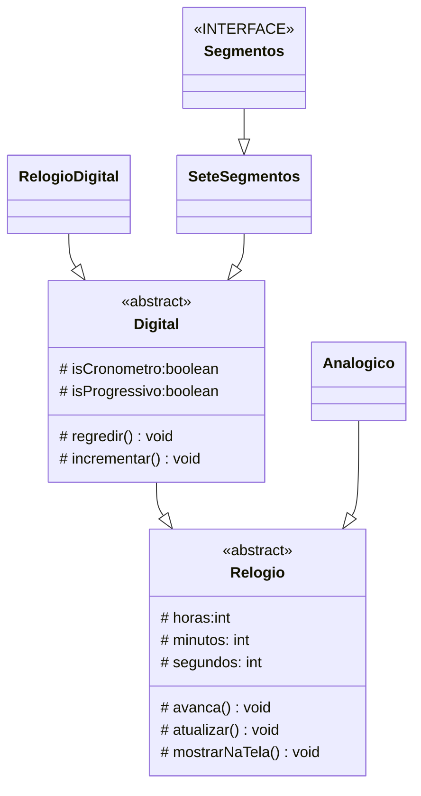

```mermaid
    classDiagram
        direction TB
        
        class Relogio{
            <<abstract>>
            # horas:int
            # minutos: int
            # segundos: int
            
            # avanca()void
            # atualizar()void
            # mostrarNaTela()void
        }
        
        class Digital{
            <<abstract>>
          # isCronometro:boolean
          # isProgressivo:boolean
          # regredir()void
          # incrementar()void
        }
        
        class Segmentos{
            <<INTERFACE>>    
        }
        
        class SeteSegmentos{
            
        }
        
        class RelogioDigital{
            
        }
        
        class Analogico{
            
        }
        
        Digital --|> Relogio
        RelogioDigital --|> Digital
        SeteSegmentos --|> Digital
        Analogico --|> Relogio
        Segmentos --|> SeteSegmentos
```