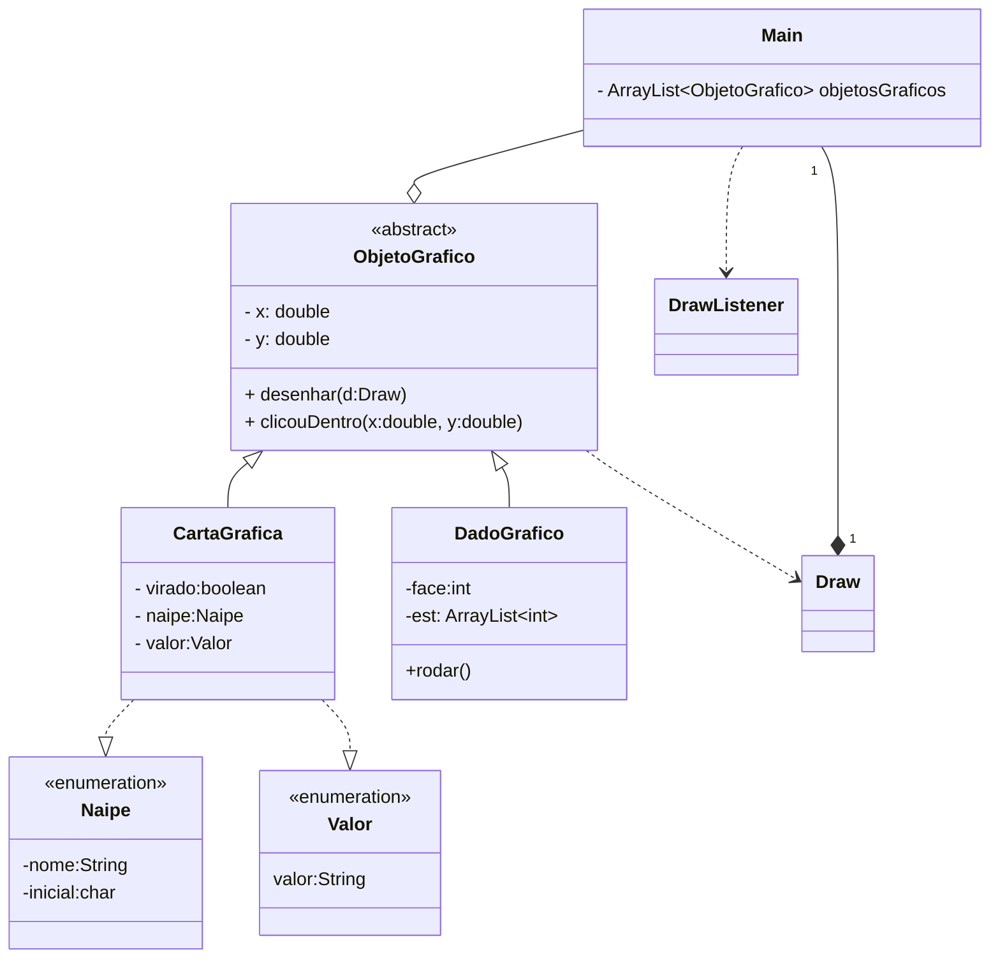
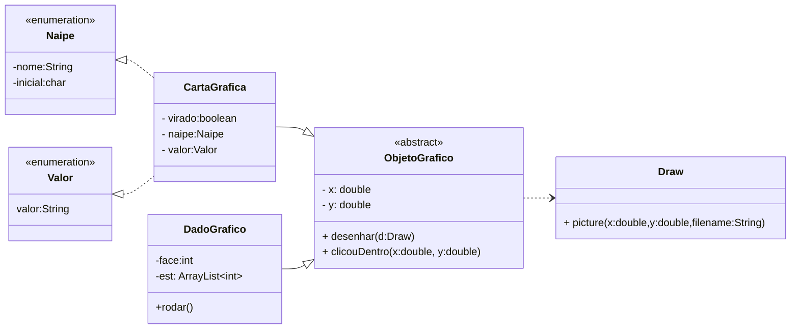

```mermaid
    classDiagram
        direction TB
        
        class ObjetoGrafico{
            <<abstract>>
            - x: double
            - y: double
            
            + desenhar(d:Draw)
            + clicouDentro(x:double, y:double)
        }
        
        class CartaGrafica{
            - virado:boolean
            - naipe:Naipe
            - valor:Valor
        }
        
        class DadoGrafico{
            -face:int
            -est: ArrayList~int~
            +rodar()
        }
        
        class Naipe{
            <<enumeration>>
            -nome:String
            -inicial:char
        }
        
        class Valor{
            <<enumeration>>
            valor:String
        }
        
        class Main{
            - ArrayList~ObjetoGrafico~ objetosGraficos
        }

        class DrawListener{
           
        }

        class Draw{
            
        }

        Main ..> DrawListener
        ObjetoGrafico ..> Draw
        Main "1" --* "1" Draw
        
        Main --o ObjetoGrafico
        ObjetoGrafico <|-- CartaGrafica
        ObjetoGrafico <|-- DadoGrafico
        CartaGrafica ..|> Naipe
        CartaGrafica ..|> Valor


        
```

```mermaid
    classDiagram
        direction LR

        class Draw{
            + picture(x:double,y:double,filename:String)
        }
        
        class ObjetoGrafico{
            <<abstract>>
            - x: double
            - y: double

            + desenhar(d:Draw)
            + clicouDentro(x:double, y:double)
        }
        
        class CartaGrafica{
            - virado:boolean
            - naipe:Naipe
            - valor:Valor
        }
        
        class DadoGrafico{
            -face:int
            -est: ArrayList~int~
            +rodar()
        }

    class Naipe{
        <<enumeration>>
        -nome:String
        -inicial:char
    }

    class Valor{
        <<enumeration>>
        valor:String
    }
        
        ObjetoGrafico ..> Draw
        CartaGrafica --|> ObjetoGrafico
        DadoGrafico --|> ObjetoGrafico
        Naipe <|.. CartaGrafica
        Valor <|.. CartaGrafica

```