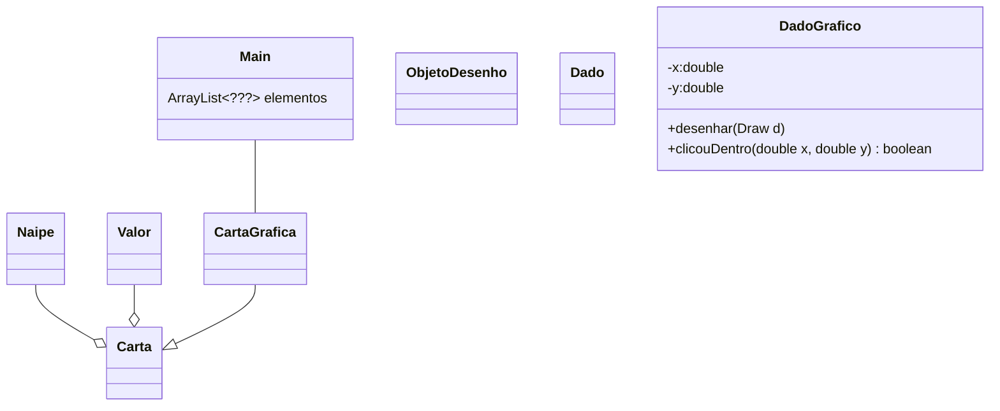

```mermaid
    classDiagram
        direction TB
        
        class Naipe{
            
        }
        
        class Valor{
            
        }
        
        class Carta{
            
        }
        
        class CartaGrafica{
            
        }   
        
        class Main{
            ArrayList~???~ elementos
        }
        
        class ObjetoDesenho{
            
        }
        
        class Dado{
            
        }
        
        class DadoGrafico{
            -x:double
            -y:double
            +desenhar(Draw d)
            +clicouDentro(double x, double y)boolean
        }
        
         Naipe --o Carta
         Valor --o Carta
         CartaGrafica --|> Carta
         Main -- CartaGrafica
```