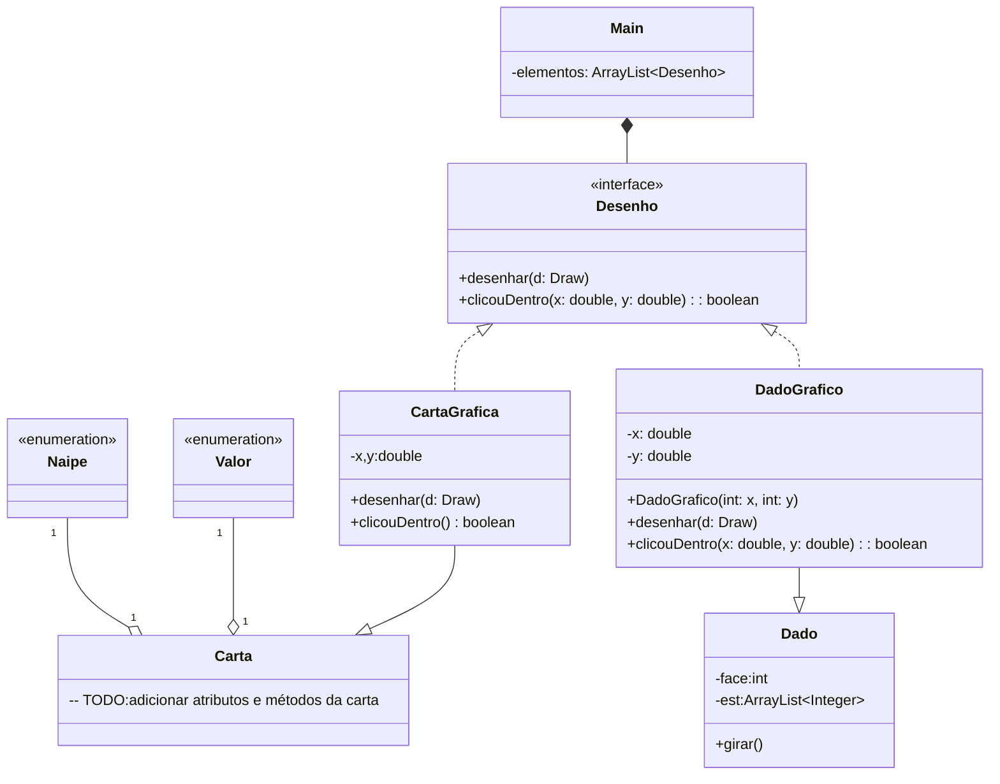

```mermaid
classDiagram
direction TB

    class Naipe {
        <<enumeration>>
    }

    class Valor {
        <<enumeration>>
    }

    class Carta {
        -- TODO:adicionar atributos e métodos da carta
    }

    class CartaGrafica {
        -x,y:double
        +desenhar(d: Draw)
        +clicouDentro()boolean
    }

    class Main {
        -elementos: ArrayList~Desenho~
    }

    class Dado {
        -face:int
        -est:ArrayList~Integer~
        +girar()
    }

    class DadoGrafico {
        -x: double
        -y: double
        +DadoGrafico(int: x, int: y)
        +desenhar(d: Draw)
        +clicouDentro(x: double, y: double) : boolean
    }

    class Desenho {
        <<interface>>
        +desenhar(d: Draw)
        +clicouDentro(x: double, y: double) : boolean
    }

    Naipe "1" --o "1" Carta
    Valor "1" --o "1" Carta
    CartaGrafica --|> Carta
    DadoGrafico --|> Dado
    Desenho <|.. CartaGrafica
    Desenho <|.. DadoGrafico
    Main *-- Desenho
    
    
```